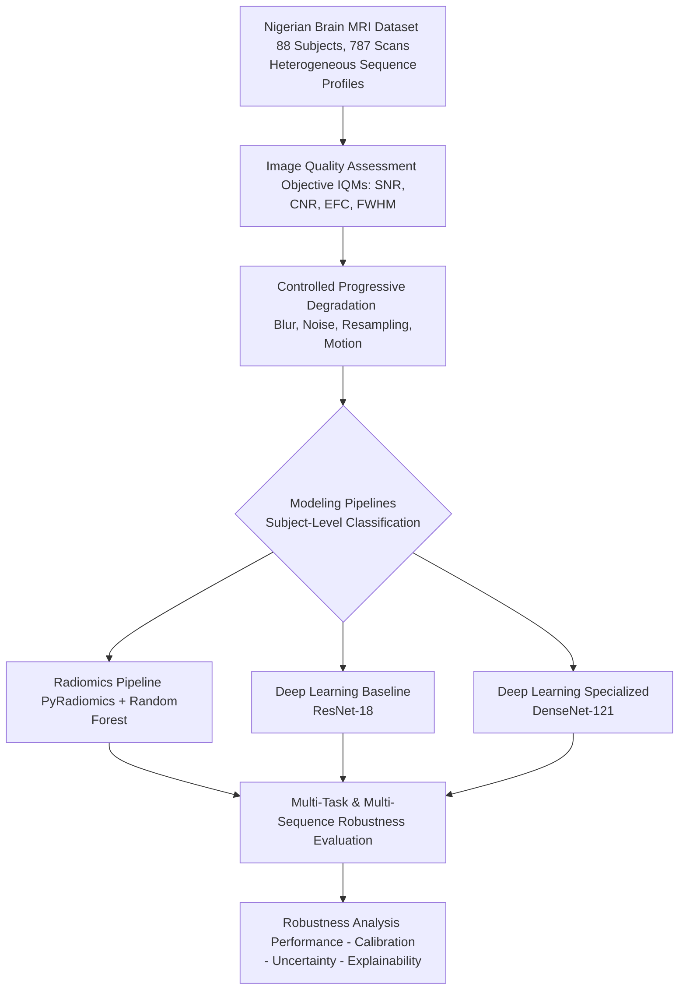

# Beyond Research-Grade MRI: A Methodological Study of AI Robustness on a Nigerian Clinical Brain MRI Dataset

[](https://opensource.org/licenses/MIT)
[](https://www.python.org/downloads/)
[](https://pytorch.org/)
[](https://monai.io/)
[](https://simpleitk.org/)
[](https://scikit-learn.org/)

> **Core Thesis:** Most neuroimaging AI systems are developed and validated on highly curated, research-grade MRI datasets. Their behavior on heterogeneous, lower-quality clinical MRI remains poorly understood, particularly in low-resource healthcare settings. This study systematically characterizes model robustness, calibration, uncertainty, and explainability using a real-world Nigerian clinical MRI dataset.

---

## Conceptual Workflow

The experimental framework of the study is structured as follows:



---

## Table of Contents
- [Research Questions](#research-questions)
- [Objectives](#objectives)
- [Dataset Specifications](#dataset-specifications)
  - [Modality Availability Statistics](#modality-availability-statistics)
- [Experimental Design](#experimental-design)
- [Methodology Overview](#methodology-overview)
- [Expected Outcomes](#expected-outcomes)
- [Limitations and Scope](#limitations-and-scope)
- [Repository Structure](#repository-structure)
- [Installation](#installation)
- [Usage](#usage)
- [Citation](#citation)
- [License](#license)

---

## Research Questions

1. **How robust are AI models across three clinically relevant neurological groups under real-world MRI quality constraints?**
2. **Which disease pair (Control vs. Dementia, Control vs. Parkinson's, or Dementia vs. Parkinson's) is most difficult to separate under progressive quality degradation?**
3. **Does image quality affect Parkinson's detection differently than dementia detection?**
4. **Which structural MRI sequence (T1, T2, or FLAIR) contributes most to classification robustness?**
5. **How does incomplete modality coverage (missing sequences) affect model robustness and generalization in multi-sequence configurations?**

---

## Objectives

### Primary Objectives
- Benchmark the robustness of classical machine learning (Radiomics-based) and deep learning models across multiple clinical tasks.
- Quantify performance degradation curves under controlled clinical image artifacts.
- Measure calibration error (Expected Calibration Error) and predictive uncertainty under out-of-distribution quality domains.
- Evaluate the stability of explainability maps (localization consistency) under progressive degradation.

### Secondary Objectives
- Characterize the mathematical correlation between objective MRI quality metrics and classification reliability.
- Evaluate the impact of missing sequences (modality dropout) on multi-modal classification robustness.
- Identify actionable quality thresholds beyond which diagnostic AI reliability substantially decreases.

---

## Dataset Specifications

Experiments are conducted on the **Nigerian Brain MRI Dataset**, reflecting a highly heterogeneous clinical environment:

- **Subjects**: 88 subjects (Control: 33 [37.5%], Dementia: 33 [37.5%], Parkinson's Disease: 22 [25.0%]).
- **Total Scans**: 787 structural images (T1w, T2w, FLAIR) acquired using 1.5T and sub-Tesla clinical scanners.
- **Heterogeneity**: Subjects do not have complete coverage across all sequences. Many subjects have only one or two modalities, with variable orientations (Axial, Coronal, Sagittal) and multiple runs.

### Modality Availability Statistics

To establish statistical feasibility for multi-sequence combinations, the sequence availability across the 88 subjects is outlined below:

| Sequence / Combination | Subjects Available | Percentage |
| :--- | :--- | :--- |
| **T1w** | 88 | 100.0% |
| **T2w** | 82 | 93.2% |
| **FLAIR** | 44 | 50.0% |
| **T1w + T2w** | 82 | 93.2% |
| **T1w + FLAIR** | 44 | 50.0% |
| **T2w + FLAIR** | 44 | 50.0% |
| **T1w + T2w + FLAIR** | 44 | 50.0% |

*Note: Exact available subject counts are verified during ingestion validation. The high frequency of missing FLAIR sequences makes evaluating missing-modality resilience highly relevant.*

---

## Experimental Design

The study is designed around two primary axes: multi-task classification and missing-modality robustness.

### 1. Multi-Task Classification Setup
Models are trained and evaluated across four distinct tasks:
* **Task 1: Control vs. Dementia** — Separation of normal aging from cognitive decline.
* **Task 2: Control vs. Parkinson's** — Sensitivity to subcortical Parkinsonian structural alterations.
* **Task 3: Dementia vs. Parkinson's** — Differential diagnostics (the most clinically significant binary task).
* **Task 4 (Primary): Three-Class Classification** — Simultaneous categorization of Control vs. Dementia vs. Parkinson's.

### 2. Sequence Availability and Missingness Analysis
Since clinical protocols do not always enforce acquisition of all sequences, we structure experiments to accommodate missing modalities:
* **Single-Modality Benchmarks**: Separate models trained on T1-only, T2-only, and FLAIR-only subsets.
* **Available-Modality Baseline**: Subject-level predictions generated using whatever sequence combinations are present.
* **Paired-Subset Analysis**: Evaluations restricted to subjects who share identical modality pairs (e.g., evaluating only on the 44 subjects with complete T1+T2+FLAIR).
* **Missing-Modality Robustness**: Test how model performance degrades when one sequence is deliberately omitted (modality dropout test).

### 3. Subject-Level Unit of Analysis
Because subjects have variable scan counts, we designate **Subject-level classification** as the core evaluation unit:
- Predictions or features are aggregated per subject rather than treating each image independently.
- This prevents data leakage (same subject's images in both training and test splits) and aligns with clinical utility.

---

## Methodology Overview

### 1. Image Quality Assessment (IQA)
We extract objective Image Quality Metrics (IQMs) to characterize spatial and statistical property changes:
- **Signal-to-Noise Ratio (SNR)**: Strength of diagnostic signal relative to background noise.
- **Contrast-to-Noise Ratio (CNR)**: Distinctness of tissue classes (gray matter vs. white matter).
- **Entropy Focus Criterion (EFC)**: Focus index; ghosting and motion blur increase voxel intensity entropy.
- **Full Width at Half Maximum (FWHM)**: Estimates effective spatial resolution and blur.

### 2. Controlled Progressive Image Degradation
We systematically apply four progressive levels of clinical degradation to establish robustness curves:
* **Gaussian Blur**: Convolution using SimpleITK to simulate spatial smoothing.
* **Gaussian Noise**: Additive zero-mean Gaussian noise to simulate low magnetic field strengths.
* **Reduced Spatial Resolution**: Representative downsampling to simulate anisotropic voxels, thicker slices, and interpolation artifacts commonly encountered in clinical acquisitions. These serve as representative quality perturbations rather than a complete simulation of every clinical scanner parameter.
* **Motion Artifacts**: Introduction of sinusoidal phase-shifts to simulate patient movement.

### 3. Model Architectures
We compare representative paradigm classes:
- **Classical ML**: Radiomics features (shape, first-order statistics, GLCM, GLRLM, GLSZM) extracted using PyRadiomics, classified using L2-regularized Logistic Regression and Random Forest.
- **Standard Deep Learning (CNNs)**: ResNet-18 (parameter-efficient baseline) and DenseNet-121 (dense feature-reuse architecture).

### 4. Robustness & Uncertainty Metrics
- **Robustness Curves**: F1-score and ROC-AUC plotted against degradation levels.
- **Calibration Assessment**: Expected Calibration Error (ECE) and Brier Score.
- **Uncertainty Estimation**: Monte-Carlo (MC) Dropout and Deep Ensembles.
- **Explainability Stability**: Grad-CAM (for CNNs) and Integrated Gradients evaluated for localization consistency (IoU with clinical ROIs) and spatial correlation across degradation levels.

---

## Expected Outcomes

We hypothesize that:
1. **Radiomics Stability**: Classical radiomics models with tree-based classifiers will exhibit higher baseline robustness under mild perturbations (due to lower parameter capacity) but will scale poorly on the three-class task and differential diagnostics compared to CNNs.
2. **Modality Synergy**: Multimodal combinations will show higher relative robustness (RRI) compared to single-modality pipelines under equivalent degradation levels.
3. **Sequence Sensitivity**: Image quality degradation will affect Parkinson's classification (reliant on specific subcortical structures) more severely than dementia classification (reliant on wider cortical atrophy patterns).
4. **Explainability Drift**: Salience maps will lose anatomical focus and drift towards artifact patterns before a statistical drop in classification accuracy is observed, acting as a leading indicator of failure.

---

## Limitations and Scope

Before training or deploying the codebase, note the following parameters of the study's scope:
- **Structural MRI Only**: Analysis is limited to structural sequences (T1w, T2w, and FLAIR) and does not cover functional MRI (fMRI) or diffusion-weighted imaging (DWI).
- **Clinical MRI Domain**: Designed around low-field (1.5T and below) scanner profiles exhibiting real-world clinical quality variability.
- **Methodological Characterization**: The project's goal is to characterize model failure modes, calibration, and explainability under noise, rather than building a state-of-the-art diagnostic classifier for clinical deployment.
- **Single-Center Cohort**: The dataset represents a single-center cohort from Nigeria; caution should be exercised when generalising findings to other regional healthcare scanners.

---

## Repository Structure

```
.
├── LICENSE
├── README.md
├── requirements.txt
├── config/
│   ├── config.yaml              # Global training and evaluation parameters
│   └── degradation.yaml         # Controlled perturbation parameters
├── data/
│   ├── raw/                     # Unaltered Nigerian Brain MRI Dataset
│   └── processed/               # Preprocessed and degraded scans
├── notebooks/
│   ├── 01_eda_and_iqa.ipynb     # Exploratory analysis and quality metrics
│   └── 02_robustness_curves.ipynb# Result visualization and degradation curves
├── scripts/
│   ├── setup_env.sh             # Dependency installer
│   └── run_pipeline.sh          # Orchestrates the end-to-end pipeline
└── src/
    ├── __init__.py
    ├── data/
    │   ├── loader.py            # Subject-level PyTorch Dataset (T1, T2, FLAIR handling)
    │   └── preprocess.py        # Resampling, reorientation, and N4 bias correction
    ├── degradation/
    │   ├── perturbations.py     # Image degradation transforms (SimpleITK)
    │   └── pipeline.py          # Batch generator of degraded scans
    ├── models/
    │   ├── baseline.py          # Radiomics extractor & ML classifiers (Random Forest, LR)
    │   └── cnn.py               # Deep Learning architectures (ResNet-18, DenseNet-121)
    ├── evaluation/
    │   ├── metrics.py           # IQMs, ECE, Brier Score, and RRI metrics
    │   └── explain.py           # Grad-CAM and Integrated Gradients stability
    └── utils/
        ├── stats.py             # Mixed-effects models, DeLong test, McNemar
        └── viz.py               # Curve generation and saliency heatmaps
```

---

## Installation

### Setup
1. Clone this repository:
   ```bash
   git clone https://github.com/your-username/clinical-mri-ai-robustness.git
   cd clinical-mri-ai-robustness
   ```

2. Setup virtual environment and install dependencies:
   ```bash
   python -m venv venv
   source venv/bin/activate
   pip install --upgrade pip
   pip install -r requirements.txt
   ```

---

## Usage

### 1. Data Preprocessing
Standardize raw scans (reorientation, N4 bias correction, and resampling):
```bash
python src/data/preprocess.py \
    --data_dir ./data/raw \
    --out_dir ./data/processed \
    --resample_spacing 1.0
```

### 2. Image Quality Profiling
Generate baseline IQA metrics:
```bash
python src/evaluation/metrics.py \
    --profile_iqa \
    --data_dir ./data/processed \
    --out_file ./data/processed/iqa_metrics.csv
```

### 3. Applying Controlled Degradations
Apply blur, noise, resolution reduction, and motion artifacts:
```bash
python src/degradation/pipeline.py \
    --input_dir ./data/processed \
    --output_dir ./data/processed/degraded \
    --config config/degradation.yaml
```

### 4. Model Training
* **Train Random Forest baseline on Radiomics features:**
  ```bash
  python src/models/baseline.py \
      --train \
      --data_dir ./data/processed \
      --model randomforest \
      --out_dir ./checkpoints/rf/
  ```
* **Train DenseNet-121 on available sequences:**
  ```bash
  python src/models/cnn.py \
      --train \
      --data_dir ./data/processed \
      --model densenet121 \
      --epochs 80 \
      --batch_size 16 \
      --out_dir ./checkpoints/densenet/
  ```

### 5. Robustness & Explainability Evaluation
Evaluate across all degradation levels:
```bash
python src/evaluation/metrics.py \
    --evaluate_robustness \
    --model_dir ./checkpoints/ \
    --data_dir ./data/processed/degraded \
    --out_dir ./results/
```

Generate attribution maps to assess explainability stability:
```bash
python src/evaluation/explain.py \
    --model_path ./checkpoints/densenet/densenet121_best.pth \
    --image_path ./data/processed/degraded/L3/sub-001_T1w.nii.gz \
    --method gradcam \
    --out_dir ./results/explanations/
```

---

## Citation

If you use this repository or dataset in your research, please cite:

```bibtex
@article{clinical_mri_robustness_nigerian2026,
  title={Beyond Research-Grade MRI: A Methodological Study of AI Robustness on a Nigerian Clinical Brain MRI Dataset},
  author={Author, A. and Author, B. and Author, C.},
  journal={Journal of Medical Image Analysis},
  year={2026},
  volume={XX},
  pages={XX-XX},
  doi={10.1016/j.media.2026.xxxxxx}
}
```

---

## License

This project is licensed under the MIT License - see the [LICENSE](LICENSE) file for details.
